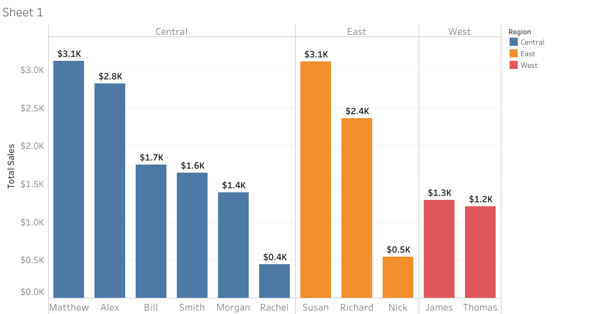

# 📊 Sales Performance by Region

## 📌 Overview
This Tableau dashboard visualizes total sales across different individuals in the **Office Supplies** dataset, categorized by region (Central, East, and West).

## 📊 Visualization

## 📈 Insights
- **Matthew & Susan** are the top performers in Central and East regions, respectively, with **$3.1K** in total sales.
- The **West region** has the lowest sales performance, with a maximum of **$1.3K** by James.
- The Central region shows a broader distribution of sales across individuals.

## 📂 Dataset
- **Source:** Office Supplies Dataset
- **Key Metrics:** Total Sales, Employee Names, Regions
